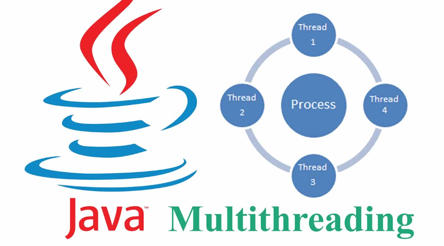
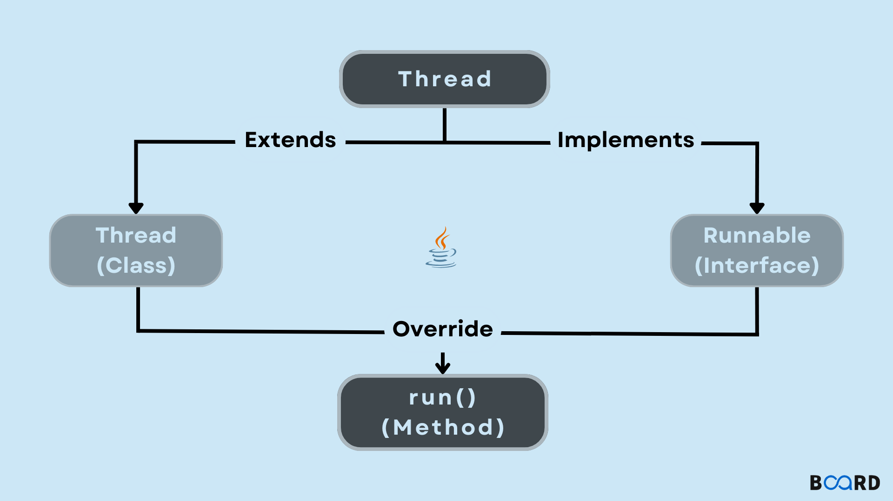
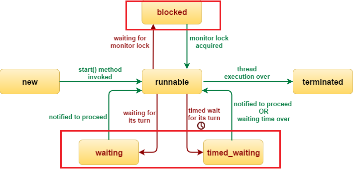

# Teoría sobre Hilos en Java

## Introducción a los Hilos (Threads)
Un **hilo** es la unidad más pequeña de procesamiento que puede ejecutar código concurrentemente con otros hilos dentro de un mismo proceso. Java proporciona soporte nativo para la programación con hilos, permitiendo realizar tareas de forma simultánea.



## Ventajas del Uso de Hilos
- Mejor aprovechamiento del CPU
- Permite operaciones concurrentes (por ejemplo, escuchar eventos mientras se procesa información)
- Mejora la experiencia de usuario en aplicaciones con interfaces gráficas

## Creación de Hilos en Java
En Java, hay dos formas principales de crear un hilo:

### 1. Extendiendo la clase `Thread`
```java
class MyThread extends Thread {
    @Override
    public void run() {
        System.out.println("Thread");
    }
}

public class Principal {
    public static void main(String[] args) {
        MyThread thread = new MyThread();
        thread.start();
    }
}
```
- Se sobrescribe el método `run()`.
- `start()` inicia el hilo y llama internamente a `run()`.

### 2. Implementando la interfaz `Runnable`
```java
class MyRunnableThread implements Runnable {
    @Override
    public void run() {
        System.out.println("Runnable Thread");
    }
}

public class Principal {
    public static void main(String[] args) {
        Thread thread = new Thread(new MyRunnableThread());
        thread.start();
    }
}
```
- Se implementa `Runnable` y se pasa al constructor de un objeto `Thread`.



## ¿Cuándo usar `Runnable`?
- Cuando se desea extender otra clase (Java no permite herencia múltiple)
- Para separar la lógica de ejecución del control del hilo
- Fomenta una mejor organización y reutilización de código

## Estados de un Hilo
Java define los siguientes estados en la clase `java.lang.Thread.State`:
1. **NEW (Nuevo)**: El hilo ha sido creado pero no ha iniciado aún (`start()` no ha sido llamado).
2. **RUNNABLE (Ejecutable)**: El hilo está listo para ejecutarse o se está ejecutando actualmente.
3. **BLOCKED (Bloqueado)**: El hilo está esperando para obtener un bloqueo (por ejemplo, acceso a un recurso sincronizado).
4. **WAITING (En espera)**: El hilo está esperando indefinidamente hasta que otro hilo lo despierte con `notify()` o `notifyAll()`.
5. **TIMED_WAITING (En espera con tiempo)**: El hilo está esperando durante un tiempo definido (por ejemplo, `sleep(ms)`, `join(ms)` o `wait(ms)`).
6. **TERMINATED (Terminado)**: El hilo ha finalizado su ejecución.



## Métodos comunes de la clase `Thread`
- `start()` - Inicia el hilo
- `run()` - Código que ejecutará el hilo
- `sleep(ms)` - Suspende el hilo por determinado tiempo
- `join()` - Espera que un hilo termine antes de continuar
- `isAlive()` - Verifica si el hilo sigue activo